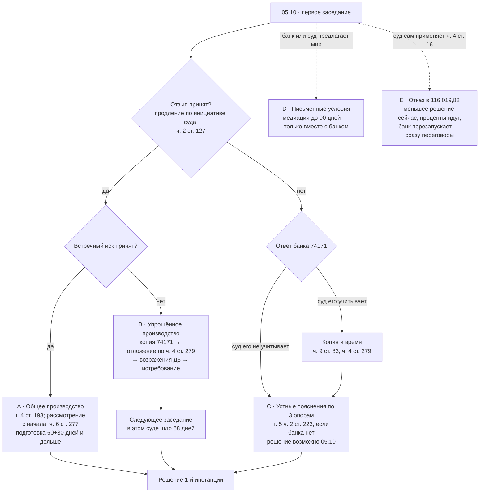
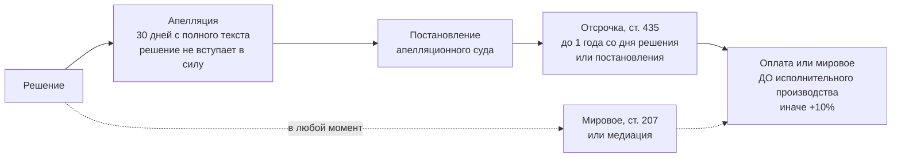

# 01 · Roadmap V3 — где мы и что дальше

_Обновлено 03.10.2026. Единственная актуальная дорожная карта. Офлайн-версия для телефона — [ROADMAP_V3.html](ROADMAP_V3.html). Стратегия — [02_СТРАТЕГИЯ.md](02_СТРАТЕГИЯ.md). Сценарий заседания — [07_ЗАСЕДАНИЕ_05-10.md](07_ЗАСЕДАНИЕ_05-10.md)._

## ▶ Вы здесь

**Суббота, 03.10.2026.** Стратегия V3 и документы готовы (PR `roadmap-v3`). До заседания осталось одно действие: **подать Д1 и Д2** через «Електронний суд» (в выходные можно, зарегистрируют в понедельник утром). Затем **05.10.2026, 10:00, ВКЗ, зал 38** — первое заседание, которое реально состоится.

## Пройденные чекпоинты

| Дата | Событие | Статус |
|---|---|---|
| 14.06.2026 | Иск банка: 184 532,63 + сбор 2 662,40 | ✔ |
| 25.06.2026 | Определение: упрощённое производство с вызовом сторон; отзыв — 15 дней; возражения — 3 дня с получения ответа банка | ✔ |
| 27.06.2026 | Определение доставлено в кабинет (02:25, суббота) | ✔ |
| 02.07.2026 | Отзыв и заявление о ВКЗ отправлены **только банку** | ⚠ ошибка второго шага |
| 09.07.2026 | Встречный иск отправлен **только банку** | ⚠ |
| 13–14.07.2026 | Истёк срок для отзыва и встречного иска | ⚠ |
| 22.07.2026 | Ходатайство об истребовании отправлено **только банку** | ⚠ |
| 27.07.2026 | Ответ банка на отзыв 74171/26-Вх, по почте; **банк тоже вне 3-дневного срока** | текста у нас нет |
| 29.07.2026 | Заседание не состоялось. Документы поданы в суд: 75356, 75363, 75447, 75449, 75452 | ✔ с опозданием |
| 30.07.2026 | Определение: ВКЗ на 05.10 и все следующие заседания | ✔ |
| 01–02.10.2026 | Вторая и третья проработки; заявление о продлении срока подписано и отправлено клиентом 02.10 | ✔ |
| **03.10.2026** | **V3:** нормы сверены с официальными текстами; найдена ВП ВС № 914/2848/22; подготовлены Д1–Д7 и шпаргалки | ✔ |

## Ближайшие чекпоинты

| Когда | Что | Кто | Где |
|---|---|---|---|
| 03–04.10 | Подать Д1 (пояснения о сроке) и Д2 (74171, ч. 4 ст. 279), оба в два шага | Клиент | [Ш3](V3_ПАКЕТ/3_ШПАРГАЛКИ/Ш3_Електронний_суд_подача.md) |
| 05.10, до 09:30 | Проверить кабинет: ухвала по заявлению 02.10? текст 74171? номера Д1/Д2? | Клиент | [07](07_ЗАСЕДАНИЕ_05-10.md) |
| 05.10, 10:00 | Заседание по сценарию; правило остановки | Клиент | [07](07_ЗАСЕДАНИЕ_05-10.md), [Ш1](V3_ПАКЕТ/3_ШПАРГАЛКИ/Ш1_05-10_одна_страница.md) |
| 05.10, вечер | Итоги — в ЖУРНАЛ, обновить этот файл | Клиент / агент | — |
| 3 дня с получения 74171 (или срок суда) | Возражения (Д3) | Клиент + агент | [Д3](V3_ПАКЕТ/2_ПОСЛЕ_05-10_заготовки/Д3_Заперечення_ЗАГОТОВКА.txt) |
| 1–2 недели после 05.10 | Запрос в банк о документах (Д6) — по решению клиента | Клиент | [Д6](V3_ПАКЕТ/2_ПОСЛЕ_05-10_заготовки/Д6_Запит_до_банку_документи.txt) |
| 30 дней с полного текста решения | Апелляция (Д4); сбор ≈ 3 993,60 | Клиент + агент | [Д4](V3_ПАКЕТ/2_ПОСЛЕ_05-10_заготовки/Д4_Апеляційна_скарга_КАРКАС.txt) |
| После вступления решения в силу | Отсрочка по ст. 435 (Д5) | Клиент | [Д5](V3_ПАКЕТ/2_ПОСЛЕ_05-10_заготовки/Д5_Заява_ст435_відстрочка_ЗАГОТОВКА.txt) |
| До открытия исполнительного производства | Оплата или мировое (Д7) | Клиент | [Д7](V3_ПАКЕТ/2_ПОСЛЕ_05-10_заготовки/Д7_Пропозиція_врегулювання_ЗАГОТОВКА.txt) |

## Карта ветвей на 05.10

## После решения: путь к деньгам

## Ориентир по времени (не прогноз)

| Ветка | Решение 1-й инстанции | Вступление в силу с апелляцией | Принудительное взыскание не раньше |
|---|---|---|---|
| **C** (худшая) | 05.10.2026 или следующее заседание | ≈ весна–лето 2027 | ≈ весна–лето 2027; с отсрочкой по ст. 435 — до ≈ 05.10.2027 |
| **B** (средняя) | ≈ декабрь 2026 – март 2027 | ≈ лето 2027 – начало 2028 | ≈ конец 2027 – 2028 |
| **A** (лучшая) | ≈ лето–осень 2027 | ≈ 2028 | 2028 и позже |
| **D** (мировое) | — | — | По графику соглашения |

Исходные данные слабые. Перерыв между заседаниями в этом суде (68 дней) — единственное наблюдение. Сроки апелляционного суда — средние ориентиры. Обеспечение иска (арест) до решения законом допускается, хотя вероятность низкая.

## Сроки, которые нельзя пропустить

| Событие | Срок | Норма |
|---|---|---|
| Возражения на ответ банка | 3 дня с получения (или срок, назначенный судом) | определение от 25.06; ст. 180 |
| Апелляция на решение | 30 дней с оглашения полного решения или с составления полного текста | ст. 354 |
| Апелляция на отдельную ухвалу (если понадобится) | 15 дней | ст. 354 |
| Отсрочка исполнения | Подаётся после вступления в силу; не более года со дня решения или постановления | ч. 5 ст. 435 |
| Исполнительский сбор 10 % | Выносится вместе с открытием исполнительного производства | ч. 4 ст. 27 Закона «Про виконавче провадження» |

## Как обновлять

1. Каждое событие — в [ЖУРНАЛ](../../ЖУРНАЛ.md) с датой и источником.
2. Обновить «Вы здесь» и таблицы.
3. Если меняется ветка, поправить [02_СТРАТЕГИЯ.md](02_СТРАТЕГИЯ.md) и [05_ВЕЕР…](05_ВЕЕР_35_ВЕТВЕЙ_АУДИТ.md).
4. Поданный документ — в `подано/ГГГГ-ММ-ДД_Название/` (текст, вложения, статус).
5. Документ суда — в `../копии ответов…/`, имя `NNNN_ГГГГ-ММ-ДД_Название`.
6. Коммит с понятным сообщением.
